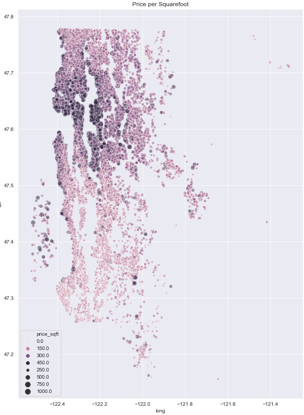

# Housing Price Prediction Modeling

## Overview

Provided is a real estate dataset of house sales in King County, Washington. The data provided in a csv (kc_house_data.csv) are as follows:
* Price - Home sale price
* Date - Sale date
* Bedrooms - Number of bedrooms
* Bathrooms - Number of bathrooms
* SQFT Living - Squarefeet of house
* SQFT Lot - Lot size
* Floors - Number of floors
* Waterfront - Home location on or off waterfront
* View - Quality of view
* Condition - Home quality condition 
* Grade - Quality of building materials
* SQFT Above - Squarefeet of home above ground
* SQFT Basement - Squarefeet of home bsement
* Year Built
* Year Renovated
* Zipcode
* Latitude
* Longitude
* SQFT Living15 - The square footage of interior housing living space for the nearest 15 neighbors
* SQFT Lot15 - The square footage of the land lots of the nearest 15 neighbors
     
The goal of this project is to predict the price of future home sales using the provided data. Initally, the data must be cleaned prior to exploration, and modeling, where multivariate linear regression will be used to provide the most accurate predictive model as possible.  

Aside from predicting the price of future home sales in the area, it's important to ask a few questions to gain further insight into the King County real estate market. These questions are geared toward real estate investing for home price appreciation and rental income. As the questions are geared more toward investing, higher priced homes will not be as relevant in this dataset.

__Questions:__
- Is there an ideal location for investing? In terms of price per squarefoot, build quality, and home condition
- Is there an ideal month to purchase a home for investing? Cheaper months to buy an investment
- Does renovating a home increase the sale price?


# Scrub Data

__Fill Null__

There are 21 total columns within the dataset, most with 21597 rows. However, there are some missing values that need to be addressed immediately.

- waterfront - 2376 missing values
- view - 63 mising values
- yr_renovated - 3842 missing values

Each one of these variables have mostly zero values (>90%), so to deal with the null values for each it's best to fill these missing values with zeros

__Convert Data Types__

Date and sqft_basement are both dtype objects. Date should be in date-time format to explore price of house vs month sold, and sqft_basement is a number so it was converted to a float dtype 

__Drop Duplicates__

Drop any duplicated homes on 'id' to avoid multiple inputs and potential future
conflict in the modeling process. There were 177 duplicates dropped

__Check for Extranous Values__

An outlier in bedrooms was detected witha  value of 33, but the square footage of the house is 1620. This is treated as a type and changed to 3 bedrooms

__Create Price/Sqft column__

As investing in afforable homes is of interest, it's best to look at home values through price per square foot. This provides further insight into house values

# Explore Data

To better understand the data that was provided, it's best to visualize each variable in graph form to determine whether to use it as a continuous variable or categorical variable. This process will also help gain insight into collinear features that need to be discarded prior to modeling.

__Correlation Check__

A quick correlation check reveals that sqft_living correlates strongly with sqft_living15 (0.76) and sqft_above (0.73), as does sqft_lot with sqft_lot15 (0.72). These three variables (sqft_living15, sqft_lot15, sqft_above) can be dropped immediate to avoid future conflict.

__Determine Categorical vs Continuous Variables__

After an initial look at the data:

Drop:
- 'id' - House id won't be a predictor of price
- 'date' - Month of house sold is the only important part of date, and a month column has been created
- 'view' - View is excluded as a predictor
         
Dependent Variable:
- 'price'
         
Continuous Variables:
- 'bedrooms'
- 'sqft_living'
- 'sqft_lot'
- 'condition'
- 'grade'
- 'yr_built'
- 'price_sqft'

*As to not overcomplicate categorical variables, keep bedrooms, condition, year built, and grade as continuous to see how they come out. It's possible to convert them to categorical after the initial modeling has been done.*
    
Categorical Variables:
- 'bathrooms' - categorical due to correlation with sqft_living
- 'floors'
- 'waterfront'
- 'sqft_basement' - binary yes, or no basement
- 'yr_renovated' - binary yes, or no renovated
- 'zipcode'
- 'lat' - break into quadrants
- 'long' - break into quadrants
- 'month' - categorize into seasons

__Explore Continuous Variables__

After visualizing the histograms, there seems to be quite a bit of skewness for most continuous variables. Grade and possibly bedrooms seem to have the only normally distributed histogram. This will be addressed later with log transformations

A few scatter plot examples of continuous variables:

 


Sqft_living and grade, show a positive correlation with home price. Whereas sqft_lot and year built dont seem to have as much of a correlation. 

Clean the data of outliers in sqft_lot, remove homes priced above 2 million dollars, and sqft lots above 250000sqft. This may help with creating more linear correlations with price across all continuous variables.

As this investigation isn't interested in investing in higher priced homes, it's probably safe to remove these outliers.


__Log Transformations__

Perform log transformations on all continuous variables to address skewness and create normal distributions for modeling.


Log transformations seem to help with bedroom, squarefoot living, and squarefoot lot, so keep those variables with log transformations in the model. We will exclude log transformations for price, condition, grade and year built from our data to be modeled.

__Categorical Variables__

Perform binning and one hot encoding on categorical variables prior to modeling. 


# Model

__Baseline Model__

The baseline model used 92 different categories. This high number is mainly due to categorizing each individual zipcode. The baseline model used statsmodel to perform and ordinary least squares regression. Here are the results of the first model:


Right away, the baseline model has an adjusted R-squared value of 0.802. This means that the model explains 80.2% of the variability in the response data around its mean. This seems too high for a baseline model. It could indicate the model is too complex and overfitting could be an issue. This can be checked through a test-train split to assess test data against the trained model.

The test-train split resulted an error of around 11%. This means that the initial model shouldnt be overfit since the test and train values are relatively close.

High p-values from baseline model:

    sqft_basement
    fl_(1.0, 2.0]
    fl_(2.0, 3.5]
    ba_(6, 9]
    lat_(47.57, 48.0]
    mo_(3, 6]
    A handful of zipcodes

These can be dropped in the subsequent model to see if the r-squared value will improve.

__Model 2__


Dropping the high p-value variables from above didnt have much of an effect on the adjusted r-squared value at all. However after running a test train split, the test and train mean squared error values were effectively identical.

__Stepwise Regression__

Used stepwise regression to go through an iterative process where the lowest p-value variables are added to a model, and high p-value variables are rejected. This dropped 8 unwanted variables with high p-values, but returned an adjusted r-squared value that was the same as model 2.

# Interperet

The models didn't change much through a few iterations. The adjusted r-squared value stayed around 0.80, which means the model accounts for 80% accuracy when predicting home prices in the Kin County region. 13% of predictions underestimated houses by 100,000, and 16% overestimated houses by $100000


The predicted vs actual home price scatter plot shows a fairly nice 1 to 1 linear relationship between the two variables. However, the plotted values tend to skew higher than the average for more expensive homes.

## Ideal Investing Location



The most expensive homes in terms of price per square foot are clustered close to Seattle's city center. Whereas the least expensive homes are south of the city around and below 47.5 north latitude, with a small cluster located north of the city north of 47.7 north latitude. These areas are a good starting point to investigate housing locations for investment purposes. The entry price points will be more ideal for rental housing income.

Looking at building grade materials and condition reveal the same insight. Both of these locations have average house conditions ideal for renovations that could consequently greatly increase the equity value in a home for either immediate resale, or subsequent rental income.

## Best Months for House Sale/Purchase

Average home sale prices based off of month sold reveal the best time to sell a home is April through June, whereas the best time to purchase a home falls between November and February. This makes sense as the summer months are a more favorable time of year for families to relocate when school is on break. This drives both supply and demand up during this time


## House Renovation

A look at average home values of renovated and unrenovated homes, it's clear that remodeling existing home can signifcantly increase its value. The below bar graph shows renovated homes are on average over 150,000 more expensive than unrenovated homes. For investing, this is why it's so important to find locations with below average listing prices that could use an upgrade on building materials and overall condition. Investing in these types of homes will undoubtedly increase home equity and return on investment. 


# Conclusions and Recommendations

The dataset of home sale prices in the King County area provided enough variable information to perform linear regression models that yielded approximately 80% predictive accuracy. The model was constrained to houses valued below 2 million, with lot sizes under 250,000 square feet. Even with these contraints, the models predictive capabilities deviated with higher home prices. The deviation really becomes apparent at around $1.25 million.

The most signifiant coefficient is zipcode with a range between -62900 and 894000, the second most significant postive coefficient is square feet of a home at 234000, and the most negative coefficient is bedrooms. The positive coefficients indicate the weight of influence the independent variables have on the mean of the dependent variable to increase; there is the opposite effect for negative coefficients on the dependent variable.

Questions:
1. Is there an ideal location for investing? -- Taking into account price per square foot, home condition, and building materials, the two best areas to invest in are south of Seattles city center, and a small pocket north of the city. These areas provide a below average price per square foot along with average conditions and building materials ideal for renovations before renting.
2. When is the best time to buy/sell a home? -- Purchasing a home for investment purchases should be in the winter months between November and February, whereas selling an investment property should be done between April and June for a higher return on investment.
3. Is there a signifant difference in home price between unrenovated and renovated home? -- The data shows that renovating a home can potentially increase its value by over $150,000

Recommendation:

The initial steps in creating a predictive home price model provided 80% accuracy, but there is always room for improvement. Taking more data into account can help increase the models predictive capabilities. Adding more variables such as population density, crime rate, school rating, proximity to amenities, and proximity to industrial areas would definitely help in doing so. 

As home prices increased, the model became less accurate, so somehow refining the model based on price-points of interest could also help tighten the model for accuracy.


```python

```
